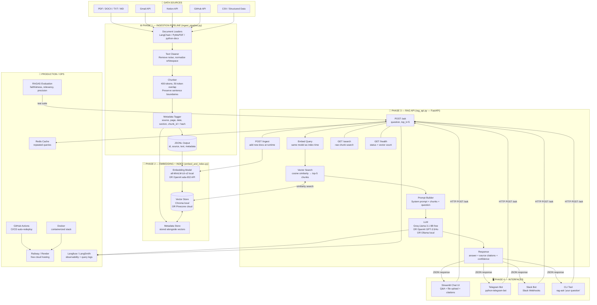

# Personal RAG AI System — Architecture

## Full System Architecture



---

## Data Flow — Step by Step

```
USER QUESTION
     │
     ▼
[Interface: Streamlit / Telegram / Slack / CLI]
     │  HTTP POST /ask { question }
     ▼
[FastAPI — /ask endpoint]
     │
     ├─1─▶ Embed question  →  [Embedding Model]  →  query_vector
     │
     ├─2─▶ Search vector store  →  [Chroma / Pinecone]  →  top-5 chunks
     │                                      ▲
     │                              (indexed at ingest time)
     │
     ├─3─▶ Build prompt:
     │        System: "Answer ONLY from context. Cite sources."
     │        Context: chunk1 + chunk2 + chunk3 + chunk4 + chunk5
     │        Question: user's question
     │
     ├─4─▶ Call LLM  →  [Groq / OpenAI / Ollama]  →  answer text
     │
     └─5─▶ Return JSON:
              { answer, sources: [{file, page, excerpt}], confidence }
```

---

## Component Responsibility Map

| Layer | Component | Responsibility |
|---|---|---|
| Sources | Gmail, Notion, PDF, GitHub | Raw data |
| Ingestion | `ingest_pipeline.py` | Parse → chunk → tag → JSONL |
| Embedding | `embed_and_index.py` | Text → vectors → vector DB |
| Vector DB | Chroma / Pinecone | Store & search vectors |
| API | `rag_api.py` | Orchestrate retrieve → generate |
| LLM | Groq / OpenAI / Ollama | Generate grounded answer |
| Interfaces | Streamlit / Telegram / CLI | User-facing interaction |
| Ops | Docker / Redis / Langfuse | Infra, caching, observability |

---

## Deployment Architecture

```
                        ┌─────────────────────────────┐
                        │        Railway / Render       │
                        │   ┌──────────────────────┐   │
                        │   │   FastAPI (rag_api)   │   │
                        │   │   + Redis cache       │   │
                        │   └──────────┬───────────┘   │
                        │              │                │
                        │   ┌──────────▼───────────┐   │
                        │   │   Pinecone (cloud)    │   │
                        │   │   Vector Store        │   │
                        │   └──────────────────────┘   │
                        └─────────────────────────────┘
                                       ▲
              ┌────────────────────────┼────────────────────────┐
              │                        │                        │
   ┌──────────▼──────┐    ┌────────────▼───────┐   ┌──────────▼──────┐
   │ Streamlit Cloud  │    │  Telegram Bot       │   │  Slack Bot      │
   │ (Chat UI)        │    │  (Mobile access)    │   │  (Team access)  │
   └──────────────────┘    └────────────────────┘   └─────────────────┘
```
